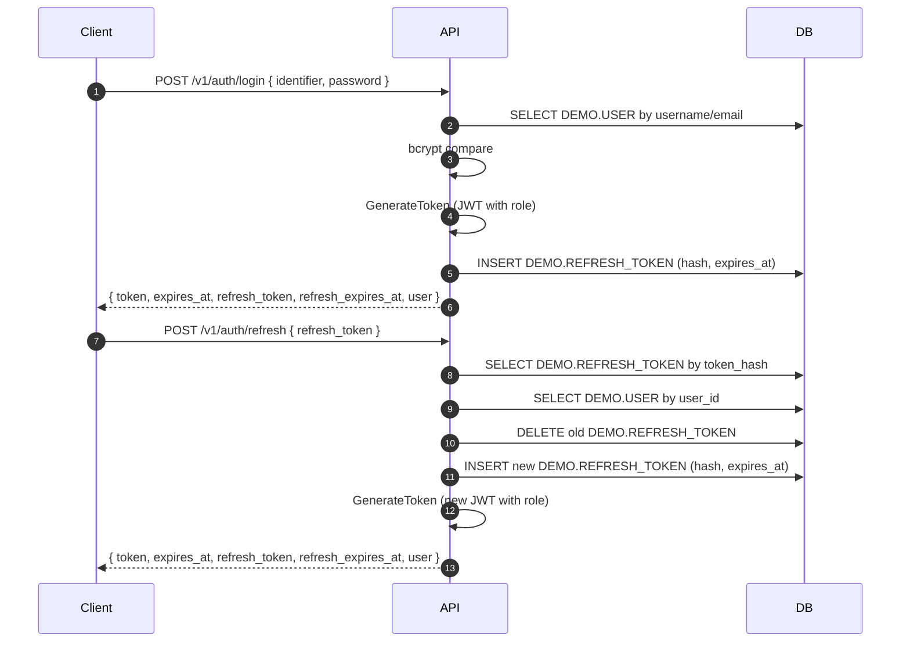

# Go REST API Service — Architecture

Goals

- Build a minimal, idiomatic Go REST API with auth (JWT) and PostgreSQL using ORM (GORM).
- Support refresh tokens with rotation and role-based claims in access tokens.
- Moderate privacy: no secrets in code; env-based config; minimal dependencies.
- Follow the repository rules in [.cursor/rules/go-project-rules.md](.cursor/rules/go-project-rules.md).

High-level design

- HTTP server using net/http.
- Authentication service for registration, login, refresh, and token verification.
- Structured logging with log/slog; request logging middleware captures headers, bodies (truncated), status, and latency.
- Basic metrics via expvar.
- Graceful shutdown and context-driven cancellation.

Project layout

- [cmd/api/main.go](cmd/api/main.go)
- [cmd/seed/main.go](cmd/seed/main.go)
- [internal/config/config.go](internal/config/config.go)
- [internal/http/server.go](internal/http/server.go)
- [internal/http/router.go](internal/http/router.go)
- [internal/http/middleware.go](internal/http/middleware.go)
- [internal/http/handlers/health.go](internal/http/handlers/health.go)
- [internal/http/handlers/auth.go](internal/http/handlers/auth.go)
- [internal/http/handlers/middleware.go](internal/http/handlers/middleware.go)
- [internal/http/handlers/json.go](internal/http/handlers/json.go)
- [internal/db/db.go](internal/db/db.go)
- [internal/db/seed.go](internal/db/seed.go)
- [internal/auth/service.go](internal/auth/service.go)
- [internal/observability/logging.go](internal/observability/logging.go)
- [internal/observability/metrics.go](internal/observability/metrics.go)
- [internal/version/version.go](internal/version/version.go)
- [Dockerfile](Dockerfile)
- [docker-compose.yml](docker-compose.yml)
- [README.md](README.md)

API surface

- Auth
  - POST /v1/auth/register
  - POST /v1/auth/login
  - POST /v1/auth/refresh
  - GET /v1/auth/me
- Platform
  - GET /healthz
  - GET /readyz
  - GET /debug/vars

Configuration

- PORT (default 8080)
- LOG_LEVEL (info, debug, warn, error; default info)
- REQUEST_TIMEOUT (e.g., 30s)
- MAX_BODY_BYTES (e.g., 1MiB)
- ALLOWED_ORIGINS (for CORS; optional)
- DATABASE_URL (PostgreSQL DSN)
- JWT_SECRET (HMAC secret)
- JWT_TTL (e.g., 24h)
- REFRESH_TTL (e.g., 720h; 30 days)

Dependency policy

- Standard library first: net/http, log/slog, expvar, encoding/json, context.
- Add external deps only if clear benefit and they meet the rules.
- ORM: GORM with postgres driver for DB access and migrations.

Error handling

- No panics for expected failures.
- Return errors with context using fmt.Errorf with %w.
- Single logging boundary: handlers log with request context; do not double-log.
- JSON error envelope: {"error":{"code":"...", "message":"..."}}
  - 400: validation errors, bad JSON
  - 401: missing or invalid credentials
  - 409: resource conflict (e.g., user exists)
  - 500: unexpected server error

Observability

- Logging: slog with source, request_id, route, status, latency.
- Request logging middleware:
  - Captures masked request headers (Authorization, Cookie, Set-Cookie, X-API-Key masked).
  - Tees request body and captures response body up to a truncation cap (uses MAX_BODY_BYTES for limits).
  - Logs method, path, status, resp_size, remote, dur_ms, request_id, req_headers, req_body, resp_body.
  - Implementation: [internal/http/middleware.go](internal/http/middleware.go)
- Metrics: expvar counters exposed at /debug/vars.
- Trace hooks: design extension points; integrate later.

Security

- Never log secrets; headers masked in logs; bodies truncated.
- Limit request body size and JSON depth.
- Set timeouts on server and outbound HTTP client.
- Basic CORS allowlist when ALLOWED_ORIGINS is set.
- JWT auth: HMAC-SHA256 tokens with TTL and subject = user ID; role included in custom claim.

Performance and reliability

- HTTP server with sensible timeouts and keep-alives.
- DB pooling tuned via database/sql settings exposed by GORM.

Graceful shutdown

- Use context cancellation and http.Server.Shutdown with a deadline.
- Ensure background workers exit on shutdown.

Data model and migrations

- All tables live in PostgreSQL schema DEMO.
- Models and relationships (GORM):
  - DEMO.ROLE
    - code (PK), name, description, created_by, updated_by, created_time, updated_time
  - DEMO.USER
    - id (UUID PK), username, email, password (hashed), role (FK -> ROLE.code), created_by, updated_by, created_time, updated_time
  - DEMO.REFRESH_TOKEN
    - id (UUID PK), user_id (FK -> USER.id), token_hash (sha256 hex), expires_at, created_time
- Schema creation and migration:
  - Creates DEMO schema if missing and runs AutoMigrate(Role, User, RefreshToken).
  - Implementation: [internal/db/db.go](internal/db/db.go)
- Seeding:
  - Seeds roles USER and ADMIN (idempotent) at startup.
  - Seeder helper: [internal/db/seed.go](internal/db/seed.go)
  - Standalone seeder: [cmd/seed/main.go](cmd/seed/main.go)

Authentication/Authorization

- Service: [internal/auth/service.go](internal/auth/service.go)
  - Register: validates uniqueness (username/email), hashes password (bcrypt), defaults role=USER, sets created_by/updated_by.
  - Login: verifies password, issues access token (JWT with role claim) and refresh token (opaque, stored hashed in DB).
  - GenerateToken: embeds user ID as subject and role in custom claim; TTL from JWT_TTL.
  - GenerateRefreshToken: creates 64-hex opaque token, stores sha256 hash with expiry; TTL from REFRESH_TTL.
  - Refresh: validates refresh token (by hash, expiry), rotates token (delete old, create new), issues new access token.
  - GetUserByID, ParseToken helpers.
- Middleware: [internal/http/handlers/middleware.go](internal/http/handlers/middleware.go)
  - RequireAuth: extracts Bearer token, verifies it, loads user to context.
  - Context helpers: [internal/authctx/context.go](internal/authctx/context.go)
- Handlers: [internal/http/handlers/auth.go](internal/http/handlers/auth.go)
  - Register, Login, Refresh, Me.
- Routing: [internal/http/router.go](internal/http/router.go)
  - Wires /v1/auth/register, /v1/auth/login, /v1/auth/refresh, /v1/auth/me.
  - Middleware order (outermost to innermost): withRequestID → withRecover → withCORS → withRequestLogging.

Mermaid: login and refresh flow

Acceptance criteria

- go build ./... succeeds.
- go test ./... passes (add tests progressively).
- /healthz and /readyz return 200; /debug/vars is exposed.
- Auth flows:
  - Register creates a user with hashed password and unique username/email; default role=USER.
  - Login returns a signed JWT (with role claim) and refresh token when credentials are valid.
  - Refresh returns new access and refresh tokens (rotation).
  - Me returns current user with a valid Bearer token.

Containerization and orchestration

- Docker:
  - Multi-stage build produces a small alpine-based image.
  - Dockerfile at [Dockerfile](Dockerfile).
- Compose:
  - Services: postgres (postgres:16), api (built from repo).
  - Network: appnet (bridge).
  - Volumes: pgdata for PostgreSQL persistence (can be replaced with host bind mount).
  - Compose file at [docker-compose.yml](docker-compose.yml).

Future extensions

- Role-based authorization at handler/service levels.
- Password reset flows and email verification.
- OpenTelemetry tracing and Prometheus metrics.

References

- [.cursor/rules/go-project-rules.md](.cursor/rules/go-project-rules.md)
- Effective Go, Code Review Comments, Uber Go Style Guide
