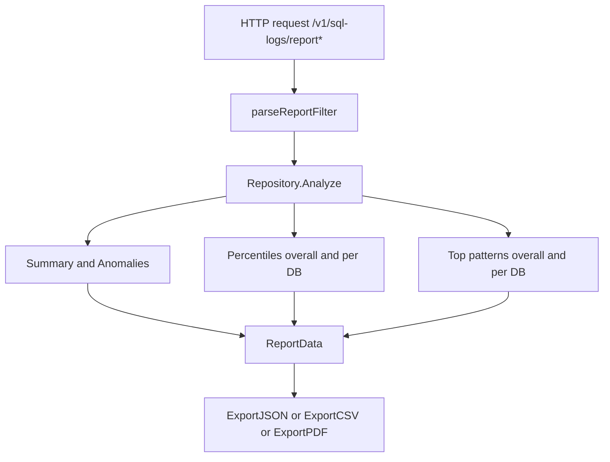

# SQL Logs Report — Extended Statistics Spec

Scope

- Extend existing report endpoints to include:
  - Percentiles for exec_time_ms and exec_count across all databases and per database
  - Most frequent query patterns across all databases and per database
- Reuse existing endpoints:
  - JSON: [handlers.SQLLogReport.ReportJSON()](internal/http/handlers/sqllog_report.go:45)
  - CSV: [handlers.SQLLogReport.ReportCSV()](internal/http/handlers/sqllog_report.go:84)
  - PDF: [handlers.SQLLogReport.ReportPDF()](internal/http/handlers/sqllog_report.go:132)

Inputs and Query Parameters

- Existing params are parsed in [parseReportFilter()](internal/http/handlers/sqllog_report.go:166)
- Add:
  - pcts: comma-separated integer percentiles in [0..100], default 50,75,90,95,99
    - Validation: unique, sorted, clamp to [0,100], max count 10; invalid values discarded with 400 if none valid
  - top_patterns: integer, default 20, min 1, max 200
- Behavior:
  - All existing filters still apply (from, to, db, thresholds, limit, cap)
  - When db is provided, across databases means the filtered dataset which only contains that db; per-database reduces to that single db

Data Model Additions

- Modify ReportFilter in [internal/sqllog/report.go](internal/sqllog/report.go)

  - Add fields:
    - Pcts []float64 // store as fractions [0..1] computed from pcts query integers
    - TopPatterns int // number of patterns to return per scope

- Extend ReportData in [internal/sqllog/report.go](internal/sqllog/report.go)
  - Add:
    - Percentiles
      - OverallExecTime map[string]float64 // key p50, p75, p90, p95, p99
      - OverallExecCount map[string]float64
      - ByDB map[string]struct {
        ExecTime map[string]float64
        ExecCount map[string]float64
        }
    - Patterns
      - Overall []PatternStat // across all DBs in the filtered window
      - ByDB map[string][]PatternStat
    - PatternStat
      - Pattern string // the normalized pattern
      - Occurrences int64 // number of rows that mapped to this pattern

Computation Plan

- Central integration point remains [sqllog.Repository.Analyze()](internal/sqllog/report.go:99)
- Steps:
  1. Normalize and validate pcts into fractions once
  2. Compute high-level summary and anomalies as today
  3. Compute percentiles (overall and per DB)
  4. Compute top query patterns (overall and per DB)
  5. Fill extended ReportData

Percentiles

- Use PostgreSQL percentile_disc with array:
  - Overall:
    - SELECT percentile_disc(ARRAY[$pcts]) WITHIN GROUP (ORDER BY exec_time_ms) AS p_exec_time, percentile_disc(ARRAY[$pcts]) WITHIN GROUP (ORDER BY exec_count) AS p_exec_count FROM DEMO.SQL_LOG WHERE created_at BETWEEN $from AND $to [AND db_name = $db]
  - Per DB:
    - SELECT db_name, percentile_disc(ARRAY[$pcts]) WITHIN GROUP (ORDER BY exec_time_ms) AS p_exec_time, percentile_disc(ARRAY[$pcts]) WITHIN GROUP (ORDER BY exec_count) AS p_exec_count FROM DEMO.SQL_LOG WHERE created_at BETWEEN $from AND $to [AND db_name = $db] GROUP BY db_name
- Map each array result to keys p<int> based on the requested input set (e.g., p50, p75, etc.)
- Note: percentile_disc returns the nearest actual value; this is appropriate for log metrics

Query Pattern Normalization

- Conservative normalization at the SQL layer using Postgres text and regex functions:
  - lower to lowercase
  - Replace string literals with ?
    - regexp_replace(sql_query, E'\\'([^\\']|\\'\\')\*\\'', ?, g)
  - Replace numeric literals with ?
    - regexp_replace(..., E'\\b[0-9]+\\b', ?, g)
  - Replace UUIDs with ?
    - regexp_replace(..., E'\\b[0-9a-fA-F]{8}-[0-9a-fA-F]{4}-[0-9a-fA-F]{4}-[0-9a-fA-F]{4}-[0-9a-fA-F]{12}\\b', ?, g)
  - Replace ISO-like dates and datetimes with ?
    - regexp_replace(..., E'\\b\\d{4}-\\d{2}-\\d{2}(?:[ T]\\d{2}:\\d{2}:\\d{2}(?:\\.\\d+)?)?\\b', ?, g)
  - Collapse whitespace and trim
    - btrim(regexp_replace(..., E'\\s+', ' ', g))
- Form a CTE for filtered rows and a derived column pattern and aggregate

Top Patterns

- Across all DBs (within filters):
  - WITH f AS (SELECT sql_query FROM DEMO.SQL_LOG WHERE created_at BETWEEN $from AND $to [AND db_name = $db]), norm AS (SELECT btrim(regexp_replace(LOWER( ... replacements ... ), E'\\s+', ' ', 'g')) AS pattern FROM f) SELECT pattern, COUNT(\*) AS occurrences FROM norm GROUP BY pattern ORDER BY occurrences DESC LIMIT $top_patterns
- Per DB:
  - WITH f AS (SELECT db_name, sql_query FROM DEMO.SQL_LOG WHERE created_at BETWEEN $from AND $to [AND db_name = $db]), norm AS (SELECT db_name, btrim(regexp_replace(LOWER( ... replacements ... ), E'\\s+', ' ', 'g')) AS pattern FROM f), agg AS (SELECT db_name, pattern, COUNT(\*) AS occurrences FROM norm GROUP BY db_name, pattern) SELECT db_name, pattern, occurrences FROM (SELECT db_name, pattern, occurrences, ROW_NUMBER() OVER (PARTITION BY db_name ORDER BY occurrences DESC) AS rn FROM agg) t WHERE rn <= $top_patterns ORDER BY db_name, occurrences DESC
- Ranking is by number of occurrences (row count), descending

CSV Export Additions

- Extend [sqllog.Repository.ExportCSV()](internal/sqllog/report.go:260)
  - New sections before anomalies:
    1. Percentiles Overall
       - key,value lines:
         - percentiles_overall_exec_time_ms, p50=...,p75=...,p90=...,p95=...,p99=...
         - percentiles_overall_exec_count, p50=...,...
    2. Percentiles By DB
       - one line per db: percentiles_db_exec_time_ms[DB], p50=...,...
       - one line per db: percentiles_db_exec_count[DB], p50=...,...
    3. Top Patterns Overall
       - header: pattern,occurrences
       - rows for each pattern
    4. Top Patterns By DB
       - for each DB, header line: top_patterns[DB], count=N
       - rows: pattern,occurrences
  - Keep anomalies table as-is after a blank line

PDF Export Additions

- Extend [sqllog.Repository.ExportPDF()](internal/sqllog/report.go:311)
  - After Summary:
    - Subsection Percentiles Overall as two small tables
    - Subsection Percentiles By DB as a multi-row table
    - Subsection Top Patterns Overall as a two-column table [pattern, occurrences]
    - Subsection Top Patterns By DB:
      - For each DB, list up to top_patterns patterns; paginate when necessary
  - Reuse the existing pagination header routine; ensure new sections check for pageBottom and print headers again as needed

Swagger Annotations

- Update in:
  - [handlers.SQLLogReport.ReportJSON()](internal/http/handlers/sqllog_report.go:45)
  - [handlers.SQLLogReport.ReportCSV()](internal/http/handlers/sqllog_report.go:84)
  - [handlers.SQLLogReport.ReportPDF()](internal/http/handlers/sqllog_report.go:132)
- Add:
  - @Param pcts query string false "Comma separated percentiles in 0..100. Default 50,75,90,95,99"
  - @Param top_patterns query int false "Number of top query patterns. Default 20, min 1, max 200"

Performance and Indexing

- Current helpful indexes in [db/sql/001_create_demo_sql_log.sql](db/sql/001_create_demo_sql_log.sql)
  - idx_sql_log_db_name
  - idx_sql_log_db_exec_time
- Add for range filtering:
  - CREATE INDEX IF NOT EXISTS idx_sql_log_created_at ON DEMO.SQL_LOG(created_at)
  - Optional composite for per-db window queries:
    - CREATE INDEX IF NOT EXISTS idx_sql_log_db_created_at ON DEMO.SQL_LOG(db_name, created_at)
- Percentile queries will read many rows; ensure time window is bounded by defaults and that MaxCap remains enforced for anomalies only

Testing Plan

- Unit
  - Normalization function cases: numbers, strings with escaped quotes, UUIDs, dates, whitespace collapsing; verify SQL expression via small seed data
  - Percentiles with controlled data: exact values tested for common pcts
  - Top pattern ranking ties and limit enforcement per DB
- Integration
  - Seed with [internal/db/seed.go](internal/db/seed.go) like dataset; verify JSON, CSV and PDF endpoints produce expected sections
- Swagger
  - Re-generate and verify pcts and top_patterns in docs

Implementation Steps

- Handlers
  - Extend [parseReportFilter()](internal/http/handlers/sqllog_report.go:166) to parse pcts and top_patterns into ReportFilter
  - Update Swagger annotations on report endpoints
- Repository
  - Add helpers to run percentile queries and pattern aggregation under filters
  - Integrate in [sqllog.Repository.Analyze()](internal/sqllog/report.go:99) and fill new fields
  - Update exporters: [sqllog.Repository.ExportCSV()](internal/sqllog/report.go:260) and [sqllog.Repository.ExportPDF()](internal/sqllog/report.go:311)
- SQL
  - Append new index statements in [db/sql/001_create_demo_sql_log.sql](db/sql/001_create_demo_sql_log.sql)

Mermaid: High-level flow

Acceptance

- Backwards compatible JSON keys preserved; new fields appended
- CSV and PDF include new sections
- Default behavior matches spec without new params
- pcts and top_patterns validated and enforced

Open Questions

- None; decisions confirmed:
  - pcts default 50,75,90,95,99, override allowed
  - normalization conservative
  - ranking by occurrences
  - top_patterns default 20, capped at 200
